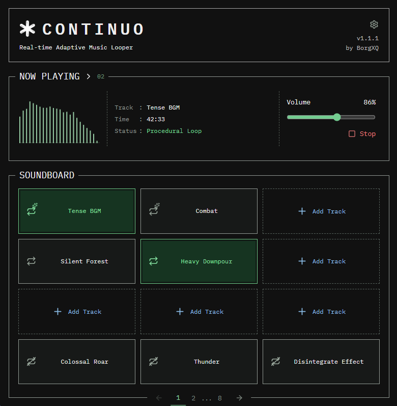

<p align="center">
  
</p>

<h1 align="center">Continuo</h1>

<p align="center">Adaptive background music for tabletop role-playing games.</p>

<p align="center">
  <a href="https://github.com/BorgXQ/continuo/releases">Downloads</a> |
  <a href="CHANGELOG.md">Changelog</a> |
  <a href="docs/windows-release.md">Build for Windows</a>
</p>

Continuo plays local MP3s and finds alternative transitions within each track, letting your soundtrack continue while you focus on the game.

<p align="center">
  
</p>

## Install

Continuo targets **Windows x64**. Download the Setup `.exe` for your chosen version from [GitHub Releases](https://github.com/BorgXQ/continuo/releases), run it, and open Continuo.

## Start Playing

1. Add local MP3 files to **SOUNDBOARD**.
2. Click a track to play it. Use its loop icon to change playback mode.
3. For procedural looping, right-click the track and choose **Analyze**.
4. Once analysis finds a safe looping region, select **Procedural Loop**.

| Mode | Playback |
| --- | --- |
| One Time | Plays to the end of the file. |
| Normal Loop | Repeats the whole track. |
| Procedural Loop | Follows analyzed bar transitions to keep the music going. |

Multiple tracks can play together; **NOW PLAYING** shows the most recently played or selected track first. Expand the section to access the others, adjust their volume, or stop them.

Rearrange soundboard tiles by dragging them. Right-click a track to rename it, assign a keyboard shortcut, analyze it, or remove it from the library. Analysis jobs run one at a time, queue automatically, and can be cancelled. Existing playback can continue while a track is analyzed, but busy tiles cannot start playback or change mode.

## Audio Settings

Click the gear icon above the version number to configure transition crossfade and global fade-in/out in **milliseconds**. All values save automatically and cannot be negative.

- Transition crossfade (default: 100 ms) blends the source ending with audio immediately before the destination bar, preserving the destination's downbeat timing. Durations are capped at half the shorter participating bar and the available destination pre-roll.
- Fade-in (default: 0 ms) softens the start of playback.
- Fade-out (default: 0 ms) continues playback after Stop is pressed, gradually reducing it to silence. It does not automatically fade the natural end of a file.
- Press Stop again in NOW PLAYING to end a fade-out immediately.
- **Device output** uses the system default audio device. Connect a Discord bot to select an accessible voice channel instead; see [Discord setup](docs/discord.md).

## Your Library

Tracks, tile positions, names, volumes, shortcuts, modes, completed analysis, and audio settings are saved automatically in a local SQLite database.

**Keep the original MP3s.** Continuo stores metadata, not audio snippets. Use **Locate file** in a missing track's menu to reconnect it. Relinking a file, or detecting a change in its size or modification time, clears its old analysis.

On Windows, the database is at `%APPDATA%/continuo/library.sqlite`. Playback and unfinished analysis jobs do not resume when you reopen the app.

## How It Works


The Python pipeline in `src/` compares musical context across bars. The desktop player uses the resulting graph and transition probabilities to choose where to continue, with short crossfades at alternative transitions.

Analysis uses Beat This! `small0` on CPU, followed by a DBN configured for four-beat bars. Not every track yields a safe procedural loop, and similar accompaniment does not guarantee seamless solo or melody continuation. Tracks without a safe loop remain playable in the other modes.

## Development

The desktop app uses **Electron Forge**, **React**, **TypeScript**, and **Vite**. Analysis uses **Python 3.11** and the packages in `requirements.txt`.

On **Linux/WSL**, create a virtual environment, install CPU-only PyTorch and torchaudio, then install the analysis dependencies. Windows developers should follow [Building for Windows](docs/windows-release.md).

```sh
python3.11 -m venv .venv
source .venv/bin/activate
python -m pip install torch torchaudio --index-url https://download.pytorch.org/whl/cpu
python -m pip install -r requirements.txt
python -m pip check
```

Development downloads the `small0` checkpoint on first analysis; subsequent
analyses reuse the cached file. Windows installers include it for offline use.

With Node 24 installed and the Python analysis environment prepared:

```sh
npm ci
npm start
```

Development uses `.venv`, with `bin/python` on Linux/macOS or `Scripts/python.exe` on Windows. Set `CONTINUO_PYTHON` to an absolute interpreter path to override it. Building the DBN dependency requires Git and a C/C++ compiler (Microsoft C++ Build Tools on Windows). The Python backend does not bundle the FFmpeg or FFprobe command-line executables; Electron retains its own media libraries.

```sh
npm run typecheck
npm test
python -m unittest discover -s tests -p 'test_*.py'
```

For backend bundling, installer commands, and the release checklist, see
[Building for Windows](docs/windows-release.md). These instructions are for
developers, not end users.

## License

Copyright (c) 2026 BorgXQ. Continuo's original source code is licensed under
the **GNU General Public License v3.0 only** (`GPL-3.0-only`). See [LICENSE](LICENSE)
and [NOTICE](NOTICE). Continuo is provided without warranty.

When distributing covered binaries or modified versions, comply with GPLv3's
corresponding-source requirements. The source and build instructions provided
with a release must match its binary.

## Third-Party Assets

The interface uses IBM Plex Mono; its [font license](assets/fonts/ibm-plex-mono/LICENSE.txt) is included. Third-party code and pretrained models retain their own licenses. Beat This! code and published model weights are MIT-licensed; see the [distribution notes](docs/windows-release.md#distribution-notices) before redistributing a build.
